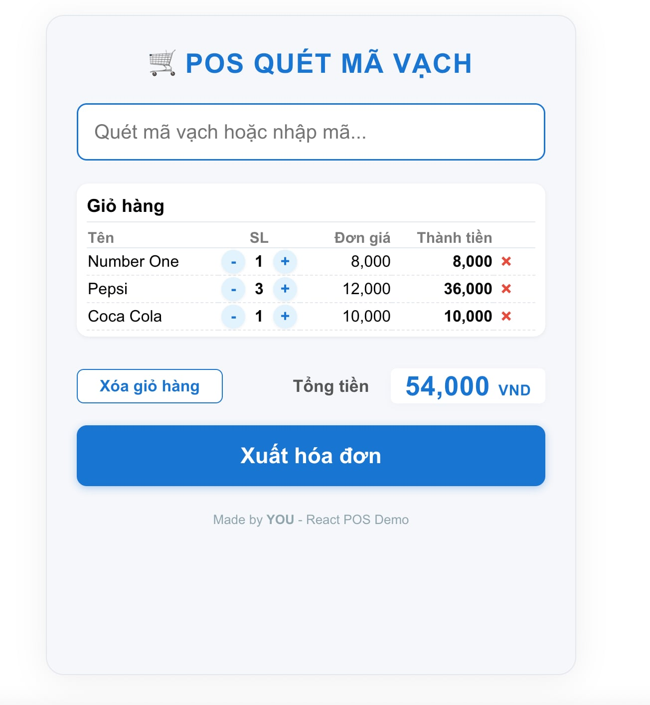

# POS Barcode System

A simple, modern Point-of-Sale (POS) web application for small shops, built with **ReactJS** (frontend) and **Node.js/Express** (backend).  
Supports barcode scanning, cart management, and printing real paper bills with QR code support.

## Features

- **Scan barcode** (by input or scanner)
- **Automatic cart management** (add, increase, decrease, remove items)
- **Live product lookup from backend**
- **Print physical bills** (like real POS) with shop info, order code, QR code
- **Responsive, POS-inspired UI**
- **Easy to customize for any shop**

---

## Tech Stack

- **Frontend:** ReactJS, CSS
- **Backend:** Node.js, Express
- **QR Code:** [qrcode.react](https://www.npmjs.com/package/qrcode.react)

---